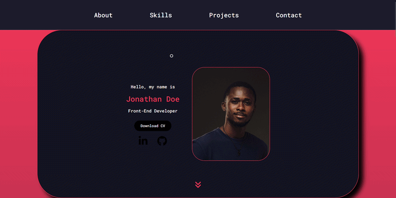
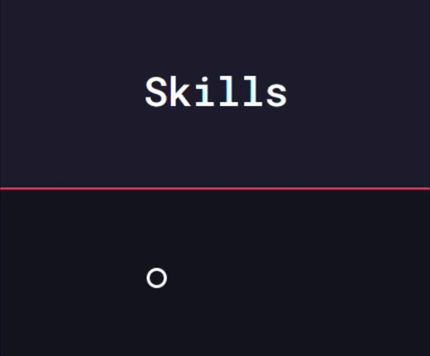
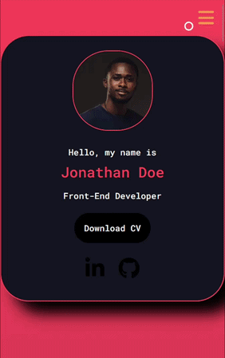
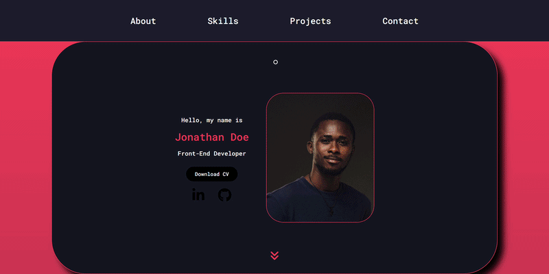
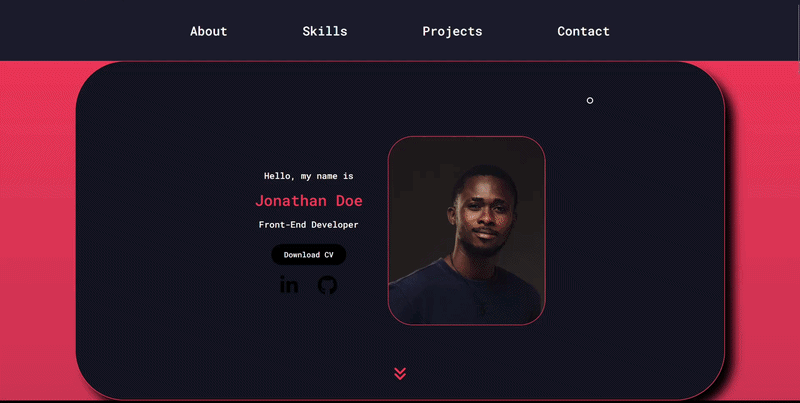
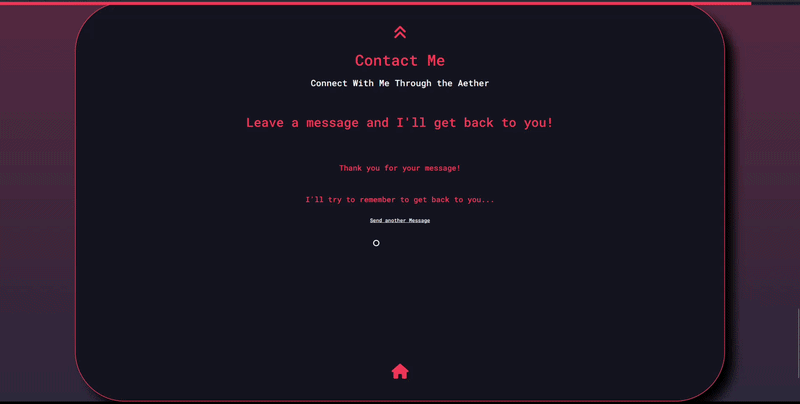

# Web Portfolio Project

# A Little Bit About This Project

A responsive personal portfolio website built with HTML, CSS and JavaScript. The site features a professional introduction, educational background, project showcase, downloadable CV, social media integration, and intuitive navigation design to provide recruiters and employers with a clear overview of my skills and experiences. Anything I have used is referenced in the footer of the website. 

# Detailed Project Description

This project is a fully responsive portfolio website developed to present my professional profile, educational background, technical skills, and personal projects.
 
 
The website includes both desktop and mobile navigation systems, featuring a traditional navigation bar and a hamburger menu for smaller phone or tablet screen. A scroll progress bar at the top provides visual feedback as users navigate through the sections. There are also smooth, anchored based navigation buttons that allow quick access to certain sections of the site.
 
 
The landing section introduces the user with a professional profile, downloadable CV, social media redirect buttons to LinkedIn and GitHub. The about section highlights my academic journey, displaying both engineering and computer science qualifications alongside relevant modules and technical competencies. There are also sections with a carousel displaying my projects from 3D prints to coding and a contact me section at the very end.
 
 
The structure is designed to provide employers and collaborators with an accessible overview of my background, combining clean user interface design with responsive web development principles.

# Features
- Responsive desktop and mobile navigation
- Hamburger menu for smaller screens
- Scroll progress indicator
- Interactive project carousel
- Downloadable CV functionality
- Contact form validation
- Loading, success and error states
- Social media integration
- Smooth section navigation
- Mobile friendly layouts

# Demonstrations of Features
## Home Page

The homepage serves as the landing section of the portfolio, providing quick links to my socials and a self-portrait to make it more personable. It features responsive navigation, social media links, downloadable CV functionality, and animated interface elements designed to create an engaging first impression while maintaining accessibility across desktop and mobile devices.
 
 
I liked the idea of including navigation arrows that when clicked take you to the next section and align what you see on the screen with what the author wants you to see. Although I couldn't make this work flawlessly when the size of the viewport is adapted for smaller screens. Maybe an improvement to fix in the future?

  </img>
 
<em align = "center"><b>Home page of the website</b></em>

## Responsive Navigation
### Highlight Animation

I opted for a traditional navigation bar that has all the links needed to quickly access all the important sections of the website. The animations were kept simple to draw the user as complicated animations would be a waste of time for this project given my knowledge at the time and to not overwhelm the user.

  </img>
 
<em align = "center"><b>Showcase of navigation button and cursor highlight animation</b></em>

### Progress Bar

I also liked the idea of incorporating a progress bar to let the user know where they were on the website i.e. if they are closer to the bottom or the top. I find when using websites that this tends to be a cleaner approach especially when you hide the scroll bar on the side. It is visually more appealing in my opinion.

  </img>
 
<em align = "center"><b>Showcase of scroll progress bar</b></em>

### Hamburger Menu

The last thing to complete basic responsive navigation on a website was making it mobile friendly given that most people access websites a lot of the time on their phones. I needed to add a hamburger menu and usually people have all sorts of animations for this menu, but I wanted to keep it simple and just let the user know that it has been activated so I opted for a simple 90 degree rotation shown in the gif below.

  </img>
 
<em align = "center"><b>Showcase of hamburger menu</b></em>

## Project Carousel

I really wanted to include a section where I could display all my projects, including my future ones. Therefore, I thought that the best way of doing this was to make a carousel that, in essence would be infinite and I could keep adding projects. Again, trying to keep it simple i would display the title of the project, an image of the project and a one sentence description of the project.

  </img>
 
<em align = "center"><b>Showcase of skills carousel</b></em>

## Contact Form Submission

Of course, I would need a contact form or some easy way that people could contact me through this website. I chose the simple pseudo form submission that my lecturer at the time helped us with. It uses JavaScript to create an illusion that the form is being submitted, and your message does not actually go anywhere. Below are a few Gifs showing what happens if the fields are left empty and what the loading process would look like.

  </img>
 
<em align = "center"><b>Showcase of contact form submission with no email error</b></em>

  </img>
 
<em align = "center"><b>Showcase of contact form submission with no subject error</b></em>

# Languages and Libraires Used
## Frontend
- HTML5
- CSS3
- JavaScript

## Libraires
- Font Awesome

## Design Principles
- Responsive Web Design
- Mobile Friendly Development
- Semantic HTML
- User Experience Orientated (UX)
- Accessibility Considerations

# Key Learning Outcomes

Through this project I was able to strengthen my understanding of:
 

- Responsive layouts using CSS
- DOM manipulation with JavaScript
- Form validation techniques
- Interactive UI development
- Mobile navigation implementation
- Front-end project organisation
- User-centred design principles

# Future Improvements

